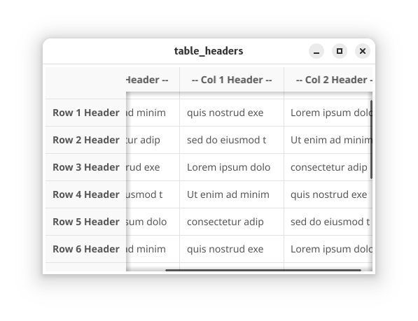
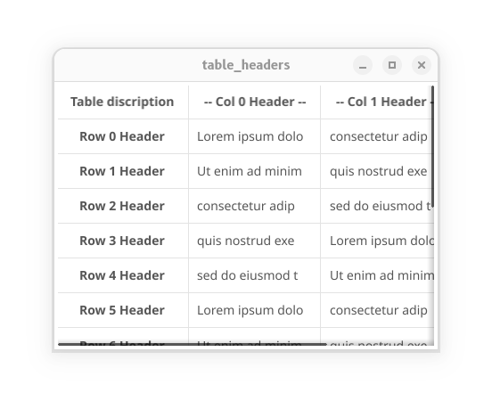

---
title: Table Headers

--- 

The `Table` collection widget supports a header row and/or column
which can be formatted to stand out from the data

Although these samples don't show it, headers can be more complex objects which could trigger table-specific operations like sorting or filtering.

There is specific support for a "sticky" header, which remains at the top or left of the
container while the data scrolls.  This support uses additional callbacks, `CreateHeader` and `UpdateHeader`.

```go
package main

import (
    "fmt"

    "fyne.io/fyne/v2"
    "fyne.io/fyne/v2/app"
    "fyne.io/fyne/v2/widget"
)

var dataTemplateText = "0123456789012345"
var sampData = []string{
    "Lorem ipsum dolo",
    "consectetur adip",
    "sed do eiusmod t",
    "Ut enim ad minim",
    "quis nostrud exe",
}

var tableCols = 3

func makeTableComponents() *widget.Table {

    table := widget.NewTable(
        // length: return #rows, #cols
        func() (int, int) {
            return 15, tableCols
        },

        // create cell template
        func() fyne.CanvasObject {
            tpl := widget.NewLabel(dataTemplateText)
            return tpl
        },

        // update cell
        func(id widget.TableCellID, cellTpl fyne.CanvasObject) {
            cell := cellTpl.(*widget.Label)

            cell.Text = sampData[(tableCols*id.Row+id.Col)%len(sampData)]

            cell.Refresh() // refresh needed after styling changes
        },
    )

    // Enable frozen row and/or column headers
    table.ShowHeaderRow = true
    table.ShowHeaderColumn = true

    table.CreateHeader = func() fyne.CanvasObject {
        return widget.NewLabelWithStyle("row xx header",
            fyne.TextAlignCenter,
            fyne.TextStyle{Bold: true, Underline: true})
    }
    
    table.UpdateHeader = func(id widget.TableCellID, template fyne.CanvasObject) {
        cell := template.(*widget.Label)

        if id.Row < 0 && id.Col < 0 {
            // even if table has both Header rows and columns,
            // the top left header cell {-1, -1} is never populated
            cell.SetText("This space intentionally left blank")
        } else if id.Row < 0 { // {row: -1, col: x} Set column header for col x
            cell.SetText(fmt.Sprintf("-- Col %d Header --", id.Col))
        } else if id.Col < 0 { // {row: x, col: -1} Set row header for row x
            cell.SetText(fmt.Sprintf("Row %d Header", id.Row))
        }
    }

    return table
}
func main() {
    a := app.NewWithID("com.example.sample.table_headers")
    w := a.NewWindow("table_headers")

    table := makeTableComponents()

    w.SetContent(table)
    w.Resize(fyne.NewSize(430, 300))
    w.ShowAndRun()
}
```

This renders like so:



## scrolling headers

It is possible to render a table with multiple rows or columns of headers, 
or whose headers scroll with the data, 
or whose upper left corner contains a legend or other content.

To do this, the Table widget is "tricked" into invoking the standard `CreateCell` and `UpdateCell` callbacks with additional index values 
which are rendered as header content rather than data.

```go
package main

import (
    "fmt"

    "fyne.io/fyne/v2"
    "fyne.io/fyne/v2/app"
    "fyne.io/fyne/v2/widget"
)

var sampData = []string{
    "Lorem ipsum dolo",
    "consectetur adip",
    "sed do eiusmod t",
    "Ut enim ad minim",
    "quis nostrud exe",
}

var dataCols = 3

// to disable row or column header, set to 0
var numHeaderRows = 1
var numHeaderCols = 1

var headerTemplate = widget.NewLabelWithStyle("row xx header",
    fyne.TextAlignCenter,
    fyne.TextStyle{Bold: true, Underline: true})

// example of rendering headers within standard cell callbacks
func makeTableComponents() *widget.Table {

    table := widget.NewTable(

        // length: return #rows, #cols
        func() (int, int) {
            return 15 + numHeaderRows, // extra rows and columns for headers
                dataCols + numHeaderCols
        },

        // create cell template
        func() fyne.CanvasObject {
            return widget.NewLabel("0123456789012345")
        },

        // update cell
        func(id widget.TableCellID, cellTpl fyne.CanvasObject) {
            cell := cellTpl.(*widget.Label)
            // dataIndex is the row and column in the *data array* of the referenced cell.
            dataIndex := widget.TableCellID{Row: id.Row - numHeaderRows, Col: id.Col - numHeaderCols}
            if id.Row >= numHeaderRows && id.Col >= numHeaderCols {

                // index in the data range, render data cell
                cell.Alignment = fyne.TextAlignLeading
                cell.TextStyle = fyne.TextStyle{}
                cell.Text = sampData[(dataCols*(dataIndex.Row)+(dataIndex.Col))%len(sampData)]
            } else {
                // index is in header range
                cell.Alignment = headerTemplate.Alignment
                cell.TextStyle = headerTemplate.TextStyle

                if id.Row < numHeaderRows && id.Col < numHeaderCols {
                    cell.Wrapping = fyne.TextWrapWord
                    cell.Text = "Table discription"
                    // content for upper left corner of table
                } else if id.Row < numHeaderRows {
                    // content for the header row(s)
                    cell.Text = fmt.Sprintf("-- Col %d Header --", dataIndex.Col)
                } else { // assert id.Col < numHeaderCols
                    // content for header col(s)
                    cell.Text = fmt.Sprintf("Row %d Header", dataIndex.Row)
                }
            }

            cell.Refresh() // refresh needed after styling changes
        },
    )

    // Enable frozen row and/or column headers, set to 1
    table.StickyRowCount = 0
    table.StickyColumnCount = 0

    return table
}
func main() {
    a := app.NewWithID("com.example.sample.table_headers")
    w := a.NewWindow("table_headers")

    table := makeTableComponents()

    w.SetContent(table)
    w.Resize(fyne.NewSize(430, 300))
    w.ShowAndRun()
}

```

Which renders as:




Refer to [`widget.Table`](/api/v2.6/widget/table.html) API for additional details on how to implement headers.

